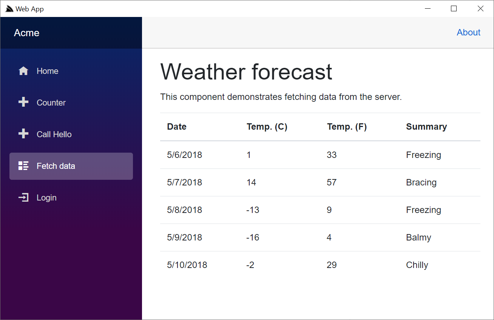

# Blazor WASM & ServiceStack for .NET 5.0 RTM

This template integrate ServiceStack with Blazor on .NET 5 RTM and [ServiceStack 5.12](https://docs.servicestack.net/releases/v5.12).

The blazor wasm app is served through the main ServiceStack web host so you can deploy a single package with both api and client ux.

## Quick Start 

Use the x tool to install this template

    $ dotnet tool install -g x

    $ x new nukedbit/blazor-wasm-servicestack ProjectName

This template come with sqlite db preconfigured so it work out of the box.

The blazor example provide a login page with the following default credentials.

    admin@localhost.local
    p@55wOrd
   
Once logged in you can test calling protected endpoints on call hello page.

ServiceStack auth is integrated with blazor on ``ServiceStackStateProvider`` and I have provided a StackBaseComponent to use as a base component in your project, so it provide the JsonHttpClient with the bearer token once authenticated.

Inside the client project you can see this.

            builder.Services.AddScoped<JsonHttpClient>(s =>
            {
                return BlazorClient.Create("https://localhost:5001");
            });

Maybe i will make this automatically get the base url in the future, any contribution is appreciated :).

## Code Sharing

Right now I have got dto sharing by using ``MyApp.ServiceModel`` project with success as suggested on [Physical Project Structure](https://docs.servicestack.net/physical-project-structure)

## Running your app

There are two launch profiles for VSCode, the firt one it will launch the app with blazor debugging, the other one it will launch only the WebHost Debugging.

1) Launch and Debug Blazor WebAssembly
2) .NET Core Launch (web)

If you don't know ServiceStack give it a try it come with a AGPL 3 license, but you can get a commercial license for cheap and it will make your day more productive and enjoyable :) 

Check the following links for more info

## Executing Blazor and ServiceStack as a Standalone Desktop app

[@mythz](https://github.com/mythz) Published an update to the [app dotnet tool](https://docs.servicestack.net/netcore-windows-desktop) that allow you to embedd this in a Windows Chromium Desktop App very easily with the latest v0.0.81+ app tool.

    $ dotnet tool update -g app
    $ x new nukedbit/blazor-wasm-servicestack Acme
    $ cd Acme\Acme
    $ dotnet public -c Release
    $ cd bin\Release\net5.0\publish
    $ app Acme.dll

When it will launch this is the end result.

As he suggested [here](https://forums.servicestack.net/t/blazor-web-assembly-template/8950/4)

You can also create a Windows Desktop Shortcut.

    $ app shortcut Acme.dll

## References

* https://docs.servicestack.net 
* https://servicestack.net 
* [Announcing ASP.NET Core in .NET 5](https://devblogs.microsoft.com/aspnet/announcing-asp-net-core-in-net-5/)

